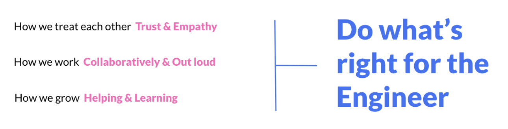

Commit was founded based on a shared value of putting people first. The trickle down effect of that is creating better leaders, working conditions and aligned opportunities. All of these aspects ultimately tie into our key operating principle to ‘**Do what’s right for the Engineer.**’

