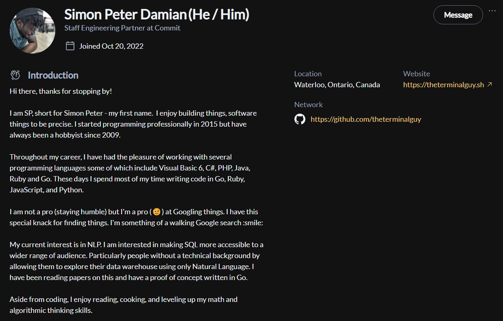
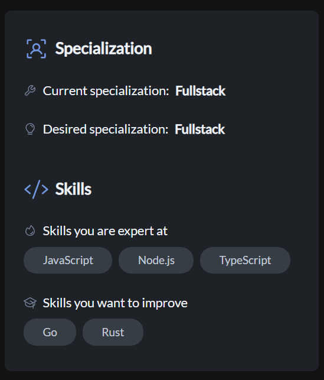
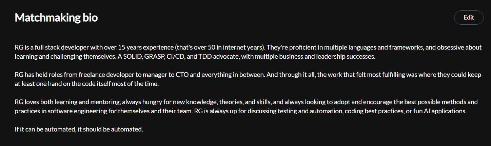
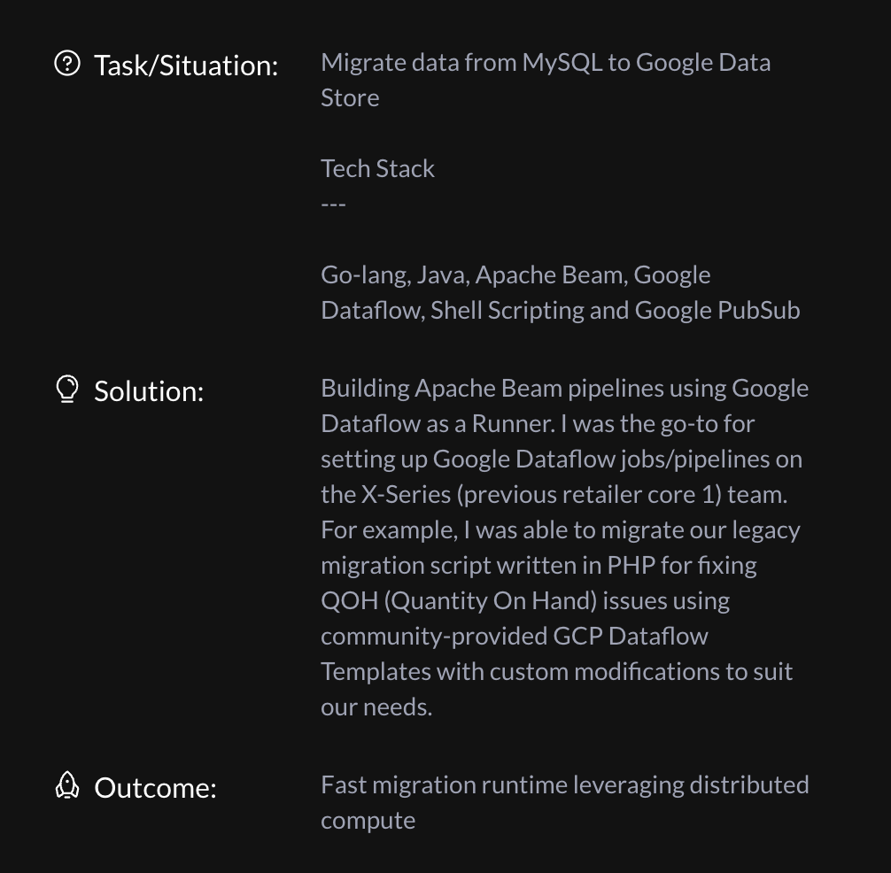
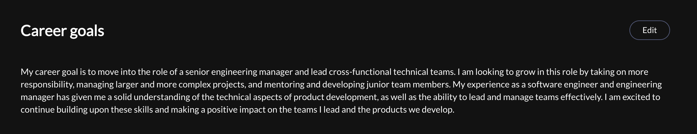
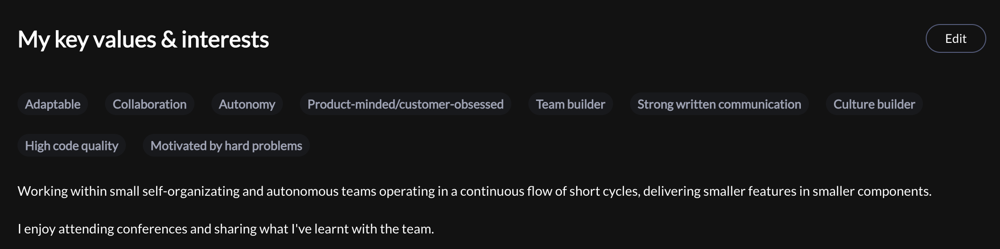

## Creating an Account[​](https://docs.commit.dev/epresources/ep-profile-guide#creating-an-account)

-   Create an account using the link provided in your onboarding.
    

## Instructions for Editing Your Profile

-   Fill out all sections of Community Profile and Matchmaking Profile
    
:::note
Matchmaking Profile is only viewable to Startup Partners (SPs), and Community Profile is viewable to all users.
:::
    

## Sections of Your Commit Platform Profile

### Community Profile

#### Introduction

-   This is your public facing "About" Section
    
-   Some prompts that can help you complete this section include:
    
-   What types of roles have you held?
    
-   What types of companies have you worked for (startups, enterprise, self-employed, etc)
    
-   What types of problems do you enjoy solving?
    
-   What can people come to you for?

**Sample Introduction**

### User Metrics

These will automatically update as you contribute to our community! Stats are fun!

:::note
When starting a project, be sure to include a link to your Github (or any other relevant link) so SPs can review!
:::

### Skills and Specializations

#### Technical Skills & Specializations

-   Indicate your Current & Desired specialization
    
-   This information helps other community members and SPs understand your overall skills and support your skills development.
    

### Matchmaking Profile (only viewable by Startup Partnerss)

  

#### How to access Matchmaking Profile

- Select the ellipses to the right of your profile to select “View matchmaking”.
:::note
This profile section is only available to members of one of our career transitions programs.
:::

#### Matchmaking Bio

Consider this your 'first impression' for our SPs! Some prompts to include in this section include:

-   Your seniority
    
-   Qualities you possess: entrepreneurial, Startup-focused, driven
    
-   Roles you’ve played/hats you’ve filled: engineering manager, sales engineer, solutions engineer, etc.
    
-   Contribution: What can the startup/team go to you for?
    

***Example Bio***

### Technical Skills

#### Productive Skills

-   I am comfortable with these skills and can get the job done with little help.
    

#### Open to Learning
-   I do not have much experience with these skills but I am open to learning.
    
 
#### Company Preferences

-   Company size
    
-   Do you want to be one of the first 3 engineers?
    
-   Do you have any industry preferences? If you're open to all industries, you may select "Any".
    

#### Work Experience
-   In this section, you have the opportunity to share in as much detail as you’d like about your prior experiences
    
-   For each role, you can add up to 3 contributions. These contributions should highlight past accomplishments, essential/soft skills, technical skills, and knowledge
    
-   Keep this concise!
    
-   SPs will be reviewing this section and prefer shorter pieces of information.
    
-   Suggestion: pick no more than 2-3 roles to describe here.
    
-   It may be helpful to pick 3 key traits/values that best describe you as an engineer and tie it in with past experiences.

- Be sure to include tech stack and how you used it!

Example:

    

#### Goals

-   What areas you want to develop professionally?
    
-   What areas do you want to hone in more or specialize in?
    
 :::note
 SPs do analyze this section, as they often look for developers who are focused on growth!
 :::
    

#### Key Values & Interests

-   What values do you possess?
    
-   How do you integrate those values into your work?

