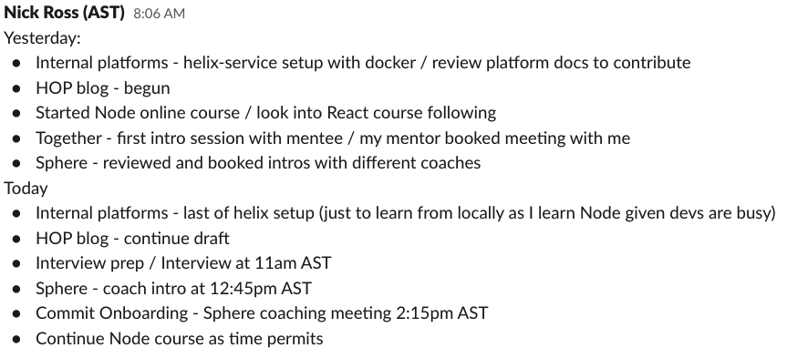
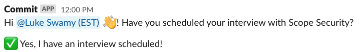

Welcome to Commit! 

Here are some critical things for you to know as an Engineering Partner (EP):

- You’re expected to respond within 24 hours during weekdays to any communication directed at you over Slack or email during onboarding, matchmaking, in between pilots, and when on a pilot.
- It’s mandatory that you make meaningful contributions in your Hackathon Onboarding Project (HOP), HOP blog, and other technical and community contributions while you’re with Commit (except when you’re on a pilot). 
- Your attendance and participation at all onboarding meetings is mandatory. When you are not on a pilot, attending and participating in all All-Hands meetings and learning sessions is also mandatory; if you are on a pilot, attendance is highly encouraged. 
- Our goal is to match you with an SP within 14 days of your start date and the Engineer Success team will support you in making the best possible SP matches. It’s also up to you to actively participate in the matching process. We’ll be in touch often, but if the process is taking longer than expected, we’ll meet with you at the 30- and 60-day marks to gain a better understanding of any challenges or shifting interests/goals. 
- If you’re having trouble following these guidelines or finding a Startup Partner that is interesting or exciting to you, we may have a conversation about whether Commit is the right fit for you at this moment.  

Below we’ve more fully outlined our expectations of you during your journey with Commit.

## Communication, Participation, and Collaboration are Key

### Communication is Essential

Communication is at the heart of a successful relationship between an EP and Commit, so timely communication is expected throughout onboarding, matchmaking, the duration of a pilot, and in between pilots. 

As an EP, you’re expected to be responsive to any Slack or email communication directed at you within 24 hours during weekdays. Weekends and holidays don’t count. 

If personal or external issues arise that prevent you from being able to work at any point during your time with Commit, please reach out to the Engineer Success team via your EPX Slack channel so we can support you.

### What You Can Expect if You Don’t Communicate in a Timely Manner

The Engineer Success team’s role is to remove blockers and work closely with you to ensure your success in the program. This is a partnership where mutual respect and communication are essential between you and the Engineer Success team. If we aren’t hearing from you, it will be difficult to support you.

If you don’t respond when expected, the Engineer Success team will be in touch with you in the following cadence:

- After 24 hours, the team will reach out via Slack and email in an effort to get in touch with you. 
- After 48 hours, we’ll send you a warning email. 
- After 72 hours, we’ll send you a final warning email. 
- After 7 days of no communication, you will be placed on unpaid leave and the Engineer Success team would discuss possible dismissal from the EP program.

We understand that extenuating circumstances arise. If this is the case for you, it’s your responsibility to get in touch with the Engineer Success team to inform them of the situation. We’d discuss the next steps internally as this is handled on a case-by-case basis. 

### Participation and Attendance Expectations 

Attendance of onboarding sessions is mandatory no matter where in the Commit journey you are. If you are not on a pilot, attending and participating in all All-Hands meetings and learning sessions is mandatory. If something urgent comes up and you are unable to attend, please notify the team via your EPX Slack channel. If you are on a pilot, attendance is highly encouraged. 

### Making Meaningful Contributions

As an EP, you’re expected to make meaningful technical and community contributions throughout your journey with Commit during onboarding, matchmaking, in between pilots, and on your pilot. Within the [EP Expectations in Onboarding](#ep-expectations-in-onboarding) and [EP Expectations During Matchmaking](#ep-expectations-during-matchmaking) articles, you’ll find worthwhile opportunities to further explore an interest, hone a skill, and learn something new. Not making meaningful contributions could result in dismissal from the EP program.  

### Collaboration within the Commit Community

Reaching out to the Commit community in the #dev Slack channel with questions and offering to help others is expected. Collaborating on a mutual project with another EP is a great way to learn, teach, and hone your skills.

## EP Expectations in Onboarding

### Onboarding Checklist
You're expected to complete the items in your [onboarding checklist](https://docs.commit.dev/eps/ep-first-2-weeks) by the end of your seventh day at Commit. If you cannot complete the items by that time, please notify the Engineer Success. 

### Technical Contribution: HOP

You’re expected to complete your HOP by your sixth day at Commit and you will present it at the HOP Demos Meeting the following Thursday after your start date. Your Onboarding Partner will check in on your HOP progress regularly to support you. 

### Community Contributions 

It’s important that you contribute to your own learning and the Commit community throughout your journey here. 

The following are examples of community contributions:

- **Blog post** - creating a blog post about your HOP experience with support from our Content team. 
- **LinkedIn** - posting on LinkedIn once per week or creating a longer blog post every two weeks about how you’re spending your time and what you’re learning.
 
### Participation and Attendance Expectations

While you’re in onboarding, you are required to attend all onboarding sessions, All-Hands meetings, and learning sessions. If something urgent comes up and you are unable to attend, please notify the Engineer Success team. 

## EP Expectations During Matchmaking

### Community Contributions

On your first dady with Commit, you’ll be added to the #ep-daily-check-in Slack channel where you’ll provide daily updates and share what you’re learning and your progress. It’s also an opportunity to identify if another EP is working on something you’d like to collaborate on and learn from one another.

Below is an example of what you could expect to post in this channel:

### Other Technical Contributions 

It’s expected that you work on one or more of the following while you’re in the matchmaking phase:

- An internal Commit project
- An open-source project of your choosing
- A MOOC (massive open online course) of your choosing (Udemy, Coursera, etc)
- Continue working on your HOP 

### Participation and Attendance Expectations

While you’re in matchmaking, you are required to attend all All-Hands meetings and learning sessions. If something urgent comes up and you are unable to attend, please notify the Engineer Success team. 

### How Quickly You Can Expect to be Matched and Start a Pilot with a Startup Partner (SP)

Our goal is to match you with an SP within 14 days of your start date. This gives you enough time to onboard and complete your HOP before getting started on exciting new work.

Should the Engineer Success team exhaust their resources, they’ll be in touch with you. The timelines shown below are when you can expect the Engineer Success team to reach out:

- Within 15 days unmatched, the Engineer Success team will book a call to chat, offer support, and let you know about the challenges in finding potential SPs for your next pilot.
- Within 30 days unmatched, the Engineer Success team will book a call to evaluate if the EP program is still a good fit for you.
- Within 45 days unmatched, the Engineer Success team and you will have a better understanding of if the EP program is a fit for you based on your interest, goals, and needs. In some cases, you could face dismissal from the EP program.

:::note
The above timelines refer to business days, not calendar days.
:::

### Playing an Active Role in Matchmaking

You’ll need to play an active role in the matchmaking process where you’re expected to respond and action the requests below within 24 hours:

- Interview requests from SPs 
- Following up with an SP who hasn’t yet booked an interview with you, but who has expressed interest
- Responding to Commit App messages in your EPX Slack channel

The following is a typical Commit App message you could expect in your EPX Slack channel where you’d respond “Yes” or “No” in a timely manner. 

### What’s Expected of You in the Matchmaking Process

You and the Engineer Success team will work together to find you a great match that aligns with your goals and interests. Should the Engineer Success team experience challenges in finding you a match, you are expected to participate in a few ways including: 

- Providing additional feedback on proposed matches that you’ve rejected to allow for better future proposed matches
- Coming in with a growth mindset and spending the time and energy to thoughtfully consider every SP opportunity

## EP Expectations When You’re on a Pilot

We want to make sure you’re getting the full experience of what full-time work with your SP is like during your 3-month pilot. 

As a Commit employee, you’re expected to respond to any communication from the Engineer Success team within 24 hours during your pilot.

Attendance of SP meetings, collaboration with the SP team, and meaningful contributions during your pilot are all essential for your long-term success. Building a strong professional relationship with the SP will help you, whether you continue on full-time after the pilot or not. 

While you’re on a pilot, your attendance at Commit’s All-Hands meetings and learning sessions is not mandatory, but highly encouraged.

### Is it Possible to be Dismissed from the EP Program?

The EP program is designed to bring together startup engineers and enrich their careers through networking, learning, and working with a variety of startups. If your needs, interests, or goals shift throughout the program, a dismissal may occur because there may no longer be a fit. If you are unable to adhere to the expectations outlined in this document, you will not be getting the most out of the program and dismissal may follow.
