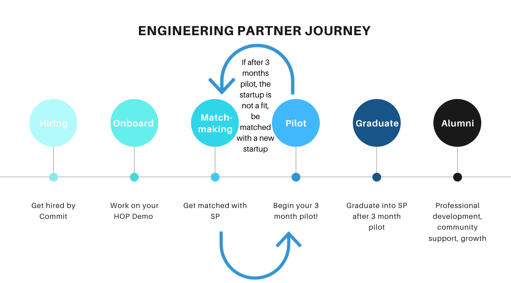

Your first week at Commit will fly by, believe us! The main emphasis in your first week is matching you with Startup Partners (SPs), helping you with any interview nerves, and getting you working on your [Hackathon Onboarding Project (HOP)](/eps/ep-hop).

To make sure nothing gets overlooked we have members of our Engineer Success Team there to support you. They will set up a private "EPX-[EP NAME]" channel on Slack so you will be able to ask any questions from Day 1. 

To go along with their support, we have created an onboarding checklist for you with daily prompts. 

## Day 1 (Part 1) - Admin Stuff

We are so excited you are here! These checklist items will be your main tasks for the next 7 days as you get acquainted with all things Commit.

Our primary point of contact is Slack so the Engineer Success team will be messaging you there in a specific channel made just for you (your EPX channel)!

If you have any questions at all during your onboarding, you can direct them there.

**Expectations**:

During your first week at Commit, your focus is on your [HOP Demo](https://docs.commit.dev/eps/ep-hop) and interviewing with Startup Partners (we call them SPs) to start your 3 month pilot. 
You'll present your HOP Demo next Thursday (Day 7 of your Onboarding) to other Engineering Partners (EPs), graduates (GPs) and interested community members! 
We've got a few of the most recent ones [recorded](https://www.youtube.com/playlist?list=PLQRTWrxEpL0SpjyzuIcvePs1LKyTP7pI3) for you to get an idea of what to expect when presenting your demo, and hopefully get you excited!

After your HOP demo, it's expected you'll continue making iterations and project updates to your original HOP.
Want to start a new one instead, or collaborate with another developer on a project? You can absolutely do that too!
The goal is for you to continue to build your skills and contribute to our community.
    
---------------------------
You should have an invite to the following meeting today (Let us know in your unique EPX Slack Channel know if you do not):
 - [ ] Welcome to Commit with Beier

-------------------------------------
    
 - [ ] Familiarize yourself with [EP Expectations](https://docs.commit.dev/eps/ep-expectations), specifically focusing on [Community Contribution expectations](https://docs.commit.dev/eps/ep-expectations#community-contributions)  

     
 - [ ] Update your LinkedIn Profile

 Update your LinkedIn using [this guide](https://docs.google.com/document/d/1Fa9-vQwBXfgj19l5ftXQihua7f8zg-dIPzl12J7g2Xs/edit?usp=sharing)! Your LinkedIn profile will be shared with SPs when introductions are made during the matchmaking process.

    
 - [ ] Pin your EPX Channel in Slack

 Open Slack in your slack app (not a browser) and pin the [epx-YOUR NAME] slack channel. This is where we'll primarily communicate with you.

    
 - [ ] If you have time, start working on your HOP Demo !

 Look at the HOP [guide](https://docs.commit.dev/eps/ep-hop) to come up with something to work on.

## Day 1 (Part 2) - Tech Stuff

 - [ ] Setup Github + SSH Key

 Feel free to create a new Github or use your own.
     
 
 [Github](https://github.com/)
 [SSH
 Key](https://docs.github.com/en/github/authenticating-to-github/connecting-to-github-with-ssh)

 - [ ] Install your favorite IDE

 ([VSCode](https://code.visualstudio.com/) is the most popular IDE at Commit)

 - [ ] Complete the values quiz

 The Values Quiz is used to help the Engineer Success team make more informed
 matches. Please take 20-30 mins to take [this survey](https://tally.so/r/mOlG73) by the end of the day. 
 This is an extra layer of context put on top of matches, not an input that will impact if you actually do get matched with a startup!
  After completing your values quiz, your "values" finding will be summarized in your EPX-[name] channel. We encourage you to use these points as drivers to add to [your platform profile.](https://app.commit.dev/)

    

 - [ ] Finish any incomplete sections of your [platform account/profile](https://app.commit.dev/).

-   You can refer to our profile guide [here](https://docs.commit.dev/epresources/ep-profile-guide).
     
-   Please be sure to upload a profile picture!
 -   The Engineer Success team will be reviewing your profile today and providing feedback to you tomorrow.

## Day 2

You'll have the following meetings today: (Let the Engineer Success team know if you do not have the invites)

 - [ ] Matchmaking at Commit 

(The Engineer Success team will be going over the matchmaking process with Startup Partners (SPs) at Commit. Ask any questions you have about your EP journey in this session!)
You can learn more about the matchmaking process [here](https://docs.commit.dev/eps/ep-matchmaking). 
    

 - [ ] Payroll, Benefits, etc.
 
 Our Operations team will be going over basic HR functions!

 - [ ] Finish your Commit Platform Profile based on the Engineer Success
       team's input

Complete your edits and send a message in your EPX Slack Channel once complete. We will look over it and provide you with feedback.

    

 - [ ] Start working on your HOP Demo!

Look at the HOP [guide](https://docs.commit.dev/eps/ep-hop) to come up with something to work on.
     
 Your Onboarding Partner will provide support here too :)
 - [ ] Draft your Project Pitch in the [Projects section](https://app.commit.dev/projects) of the platform. 
 
 - You can use our [Project Pitch Template](https://docs.google.com/document/d/1QIDBjmpAmjmvJGnvPh2cvB4yaxgHweAFdXQ9kXLb3bQ/edit?usp=sharing) for inspiration around details to include. 

:::note
Projects will be sent to SPs as part of your profile, so please be sure to include a github repo (or other shareable link) in your project.
:::
     
     
 - [ ] Set up a [Calendly](https://calendly.com/) account.

You'll use this link when you are setting up interviews with Startups.
 Follow these [guidelines](https://docs.commit.dev/epresources/ep-calendly-guide) when setting up your account.

## Day 3

- [ ] Check out our partnership with [Sphere Coaching](https://docs.commit.dev/epresources/ep-coaching-guide). 

On the first Tuesday of the month during your Onboarding, Margo from [Sphere Coaching](https://sphere.guide/) will share more about the "why" of coaching and how to use the platform. You'll receive an invite to this Onboarding Session, unless you are on a pilot.
 
  Please register ahead of the session using your mobile phone and your personal email! It should only take 10 minutes! 
  
  **Please note that everything discussed with a coach is Private & Confidential.** Feel free to just try it out, no obligation to stick to it if it is not for you.
 
 Be sure to read the testimonials linked in Resources. Some internal testimonials from other folks that went through the EP program:
     
 
 - [Prit](https://blog.commit.dev/articles/personal-coaching-at-commit-part-v-taking-a-career-break-might-be-the-best-thing-you-can-do-for-yourself-and-your-career)
    
 - [Thiago](https://blog.commit.dev/articles/personal-coaching-at-commit-part-iv-engineering-partner-thiago-araujo)
 
 - [King](https://blog.commit.dev/articles/personal-coaching-at-commit-part-ii-a-conversation-with-engineering-partner-king-choi)

 - [ ] Review our [Interview Guide](https://docs.commit.dev/epresources/ep-interview-guide)

 You will likely have interviews in the next few days! Take some time to review our Interview Guide so feel confident and comfortable going into interviews.

## Day 4

 - [ ] Work on your HOP

Any technical question about your HOP? We want to familiarize you with [asking questions on our platform](https://app.commit.dev/p2p). Our platform will be your primary community to ask questions during your time at Commit!

 - [ ] Review any SP opportunities sent to you.
 
You may have received some SP opportunities from the Engineer Success team in your EPX channel by this day. Please spend some time to review them and let the Engineer Success team know if you're interested in them or not. If you have not received any opportunities today, keep your eyes peeled for them for the rest of the week!

    Note: Please ensure you respond to the SPs in a timely manner (within 24 hrs)

## Day 5
  
 - [ ] Work on your HOP

Any technical question about your HOP? We want to familiarize you with asking questions [on our platform](https://app.commit.dev/p2p). 

## Day 6

 - [ ] Finalize any details about your HOP!

You might consider doing a dry-run of your HOP Demo by getting in touch with the Engineer Success team and/or your Onboarding Partner!

**Things to consider:**

-   You'll have 8 minutes total for your demo! Keep an eye on the chat - you'll get a 1 min warning, and then I will use the "raise hand" function when the time is up
    
-   Test your setup beforehand - do you need to reinstall Zoom? What will you need to share? Will others be able to hear you clearly with your audio setup?
    
-   We've got a few of the most recent demos [recorded](https://www.youtube.com/playlist?list=PLQRTWrxEpL0SpjyzuIcvePs1LKyTP7pI3) for you to get an idea of what to expect!
    

    

## Day 7

 - [ ] It's HOP Demo Day! Demo your HOP amongst a group of supportive
       engineers.
 - [ ] Add your HOP Demo to your [Project section](http://app.commit.dev/projects) on the platform! Our Startup Partners often review HOP Demos so it's important to make sure this is updated!
- [ ] If you haven't yet, update your LinkedIn using [this guide](https://docs.google.com/document/d/1Fa9-vQwBXfgj19l5ftXQihua7f8zg-dIPzl12J7g2Xs/edit?usp=sharing). You might even consider sharing your HOP Demo recording once it's uploaded to YouTube - just ask the Engineer Success team!
- [ ] Review the [Community Contribution expectations](https://docs.commit.dev/eps/ep-expectations#community-contributions) in our EP Expectations article so you can grow your skills and better our community!
:::note
Until your pilot, it's expected you'll continue to contribute to our community by starting at least 2 discussions weekly, and replying to at least 2 discussions weekly. 
:::

**Not placed with an SP yet?**

-   Continue working on your HOP or start a new HOP. While it's not mandatory, you are encouraged to present at future demos to share your progress and gain support and insights from our community! 
        
-   Know an awesome startup you want to join our community? [Invite them!](https://docs.commit.dev/contribute/sp-invite) 

We're looking forward to continuing to celebrate your accomplishments!! :)

