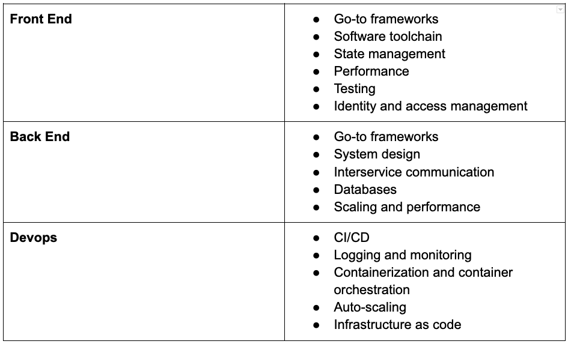

Commit doesn't believe in traditional technical interviews, using theoretical questions, algorithmic questions, (virtual) whiteboarding, and/or timed tests.

We believe the best way to gauge a developer’s level of understanding about a language or framework is by having them explain it.

Our technical assessment is premised on inquiry-based questions about actual projects the developer has worked on. They are encouraged to draw on examples of code they’ve written for work, and for side projects.

Our goal is really to understand the candidate’s technical breadth and depth, seniority, and type of work they prefer.

## What we test on

For the areas listed below, our assessors score candidates on a competency rubric - pass, mixed, or fail.
Every startup has differing needs and areas of expertise in each hire.

:::note
We encourage our startup partners to review the list below and shape their interviews around which of the below areas they’ll need the most information from to make an informed hiring decision.
:::

## How we train our assessment team

Our assessment team is a small but mighty group of Staff+ developers who are leaders in their respective organizations.

1.  All of our assessors are selected by our trusted and knowledgeable assessment lead who has over 28 years experience in software architecture and development.
    
2.  Each assessor shadows assessments and is shadowed several times before conducting assessments on their own.
    
3.  We try to match up assessors and candidates with similar skill sets in order to provide a richer and detailed conversation to fully understand the developer’s competencies.
    
4.  We provide a detailed scorecard to ensure consistency across assessments
    
5.  We provide probing question prompts to ensure a depth and quality of conversation are reached.
    

## Assessment results

In a 90 minute assessment, we aim to be as thorough as possible. We recognize that our startup partners have specific areas of expertise they want their developers to be experts in. We encourage you to dive deeper into any of these areas we assess to understand the developer’s core competencies.

We are happy to share summarized notes from a candidate’s technical assessment. However, we’ve found for the sake of speed and productivity, it’s often beneficial for startups to focus their efforts on interviews rather than reviewing assessment notes.

You know your needs better than anyone else, and the assessment can act as a springboard for future conversations between you and the candidate.
