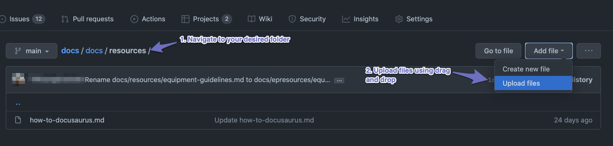

## Important files

### `docusaurus.config.js`
This file is the main configuration of the entire website, controls
- title
- themes (font-imports)
- plugins
- google analytics
- top / footer navigation items

### `sidebars.js`
This file controls the side bar in docs pages (we don't have landing page so it controls the sidebar all the time)

### `src/css/custom.css`
This is the global styling css file

### `docs/` folder
files in `md` or `mdx` in loaded from `sidebars.js` will auto populate


## How to markdown

### Basic overview of syntax
https://www.markdownguide.org/basic-syntax/

### WYSIWYG Editors to assist editing
- https://stackedit.io/app
- https://hackmd.io/home (Supports collaboration but requires sign-in)

## Documents
### Sidebar ordering and display
Docusaurus supports this format at the top of each document, common useful settings available such as these, to dive deeper to see what it supports click [here](https://docusaurus.io/docs/api/plugins/@docusaurus/plugin-content-docs#markdown-front-matter)
```
---
title: onboarding
sidebar_label: onboarding
sidebar_position: 1
---
```

### Docusaurus extra markdown features
These are features that are **ONLY AVAILABLE IN Docusaurus's version of markdown**, which we can also leverage.

#### admonitions
To provide more visually stand out blocks of content, [link for more information](https://docusaurus.io/docs/markdown-features/admonitions)

:::note
```
\:::tip
my text here
\:::
```
quick brown fox jumps over the lazy dog
:::

:::info
quick brown fox jumps over the lazy dog
:::

Note that the following additional admonitions have not been styled in Commit colours, so shouldn't be used. 

:::tip
quick brown fox jumps over the lazy dog
:::

:::caution
quick brown fox jumps over the lazy dog
:::

:::danger
quick brown fox jumps over the lazy dog
:::

## Images uploading and linking
### For images we maintain/update/host along side with the Docs
1. Navigate to your desired folder, click **Upload files**


2. Drag and drop your image into the upload box, commit the file to the repository, this step will take a little time as it uploads the image

3. In the document you want the image now you can reference the image using its **relative path**

```

```
Note: Since its uploaded in the same folder we can reference same folder using `./` + image's file name

### For images external
We can just use markdown and supply the full path, good for referencing to someone else's image we don't want to maintain (eg. Airtable documentation diagram that they maintain)
```

```
