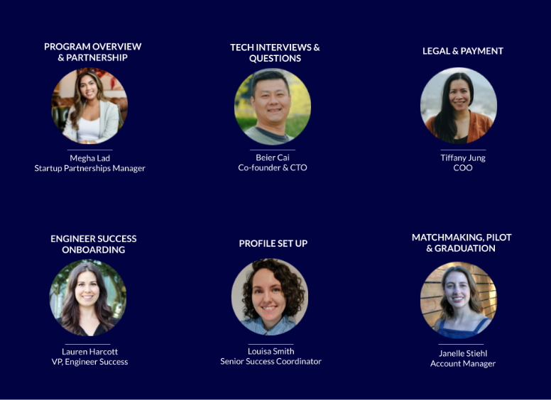

### At a glance

Hey 👋 we’re Commit, the network for the most collaborative remote startup developers.

We use data to connect developers together to solve problems faster in three key areas:

-   Peer Support - Intelligent Peer Support connects developers with experts to gather opinions, collaborate and solve problems faster.
    
-   Learning & Development - Personalized L&D helps developers connect and learn faster with other developers.
    
-   Career Transitions - Seamless Career Transitions helps developers skip to the final interview and connect directly with vetted hiring managers who want to build with them.
    
These docs were written for you to get familiar with Commit and our Startup Partner program. You’ll be in good company, we have 75 thriving partners to date.

### We vet developers so you don't have to

-   Commit employs both Senior Software Developers and Senior Full Stack Developers - from individual contributors (ICs) to Tech Leads and CTOs
    
-   Every Commit developer is eager to join a high-growth startup
    
-   We take care of the [technical assessment](https://docs.google.com/document/d/1vpUrPyYLrRB3bmWwPNZcDrdkAH7sVGBCHpAbXnCo-qY/edit?usp=sharing) so you can focus on culture fit
    
-   You’ll only pay once we find you a match and the Commit developer joins you for a 3-month pilot. All the work put into interviews and matching are free.  

Note: We already mentioned that every Commit developer wants to work with a startup. You don't have to sell candidates on why they should consider changing jobs or joining your team during a screening call - we do that legwork for you and take you straight to the types of conversations you'd expect in a final round interview.

### Spend time supporting your team, not reviewing hundreds of applications

-   After setting up your profile on the Commit app, we'll share 3 candidates with you
    
-   Choose your perfect match after one culture fit interview
    
-   In as little as 5 days, you can be shipping code together
    
-   Partner with a Commit developer for a 3-month pilot before deciding to move forward with a permanent hire
    
Note: To gain full oversight of the process to hire a Commit developer, look at the Next Steps with Commit checklist. You’ll be able to kick off the hiring process once you have reviewed the Pilot Confirmation Form.

### Access Commit’s collective intelligence through community

-   Your Commit hire remains a member of our private community and has access to Commit-organized 1:1 coaching, peer cohorts, and learning & development to replicate the support systems at a scale-up while you're still a startup
    
-   Guidance on building scalable systems from Commit's Chief Architect and DevOps team who are building our internal software
    
-   Tools to answer technical questions faster
    
### Engage with the team answering your questions

We’ve got your back, no question is too big or small for our team. Reach out to us via your dedicated Slack channel.

Within the Slack channel you’ll have access to our entire team from Success to Legal to Accounting. All you have to do is ask your questions and the right team member will respond within 24 business hours.

